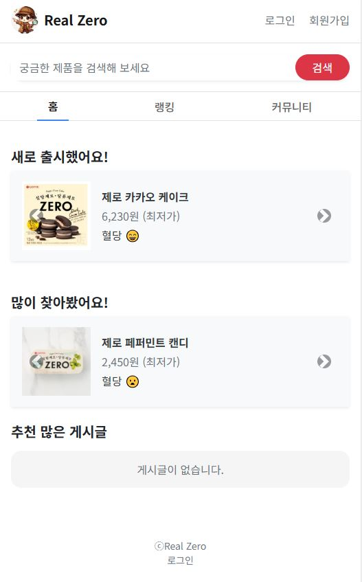
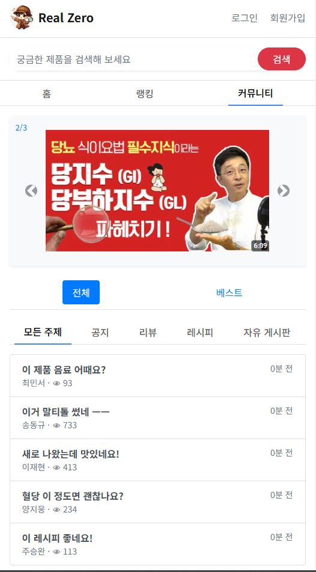
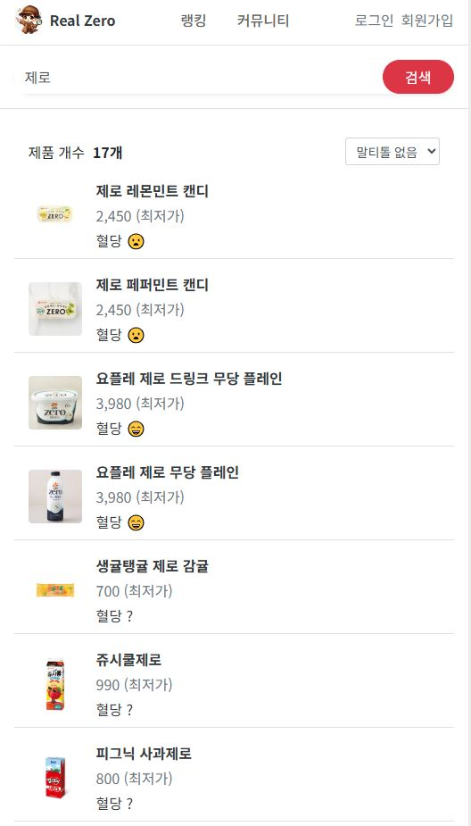
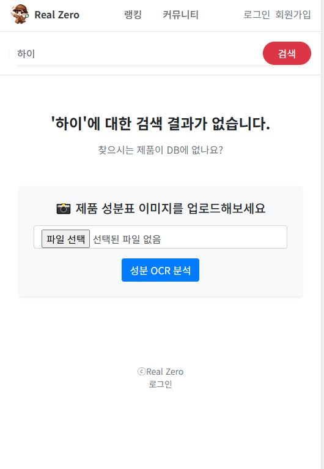
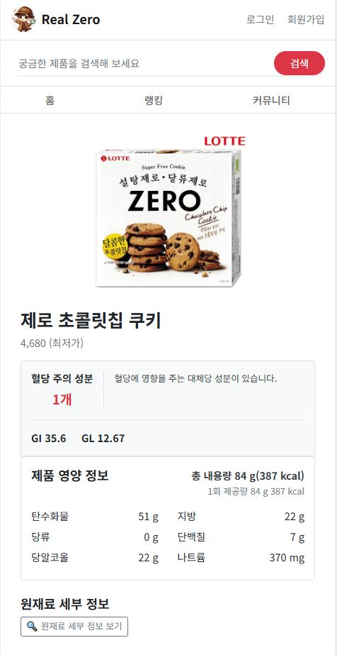
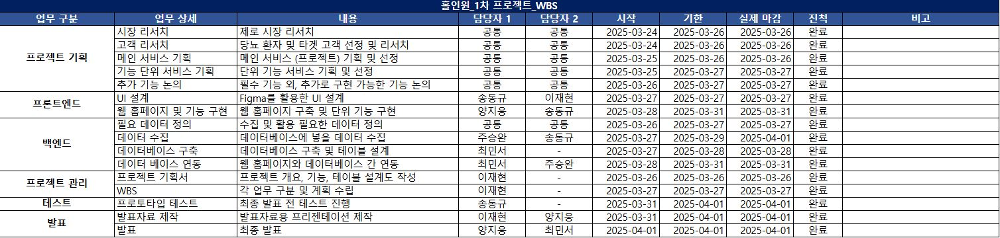

gig# real_zero
# fa05-1st-Hole_In_One
- KPMG Future Academy 5기 홀인원 팀 첫 번째 프로젝트입니다.

-------------------

# 프로젝트 기획서

## 1. 프로젝트 개요

- 프로젝트 주제 : **제로 식품의 영양성분과 혈당 영향도를 당뇨 환자들이 쉽고 간편하게 확인할 수 있는 웹서비스**
- 목표 : **웹 홈페이지를 통해 당뇨 환자들이 빠르고 간편하게, 정확하게 다양한 제로 식품들의 성분과 혈당 유의정보를 확인하여 건강 및 혈당 조절에 기여**
  
### 시각적 자료

- 홈

- 커뮤니티

- 검색 o

- 검색 x

- 세부정보 

## 2. 프로젝트 일정

# 작업 분할 구조 (WBS)

- 프로젝트 수행을 위한 WBS 작성

## 1. 단계별 작업 구성

### 1. 기획

1.1. 문제 정의

 - 건강과 맛을 동시에 추구하는 ‘헬시플레저’ 트렌드가 확산됨에 따라, ‘무당’을 강조하는 제로 식품 시장 확대 중. (제로탄산음료시장 2020년 924억 -> 2024년 3683억)
 - 그러나, 당류를 대체하기 위해 사용하는 대체당 중 말티톨, 폴리글리시톨 등 혈당을 상승시키는 대체당 다수 존재함.
 -  현행 식품법상의 제도적 한계로, 혈당에 영향을 줄 수 있는 제로 성분에 대한 표기가 미비한 상황임.
 -  위 상황에 대해 정부와 국회에서 문제를 인지하고 있으며, 제로 성분에 대한 정보 투명성 확보를 위한 제도 개선 의식 증대 중.

 - 당뇨 환자의 경우, 당류가 포함된 기존 식품을 대체하기 위해 제로 식품을 소비하는 니즈가 존재함.
 - 그러나, 제로 식품의 대체당에 대한 정보 불투명성으로 인해 당뇨 환자의 기대와 달리, 혈당이 상승하는 경우가 발생하는 사례 多.
 - 제로 식품 섭취시 발생하는 문제가 다수 발생함에 따라, 당뇨와 건강(당건) 카페 등 국내 당뇨 커뮤니티에서 제로 식품 성분에 대한 논의와 콘텐츠가 다수 언급됨.
 - 제품 탐색부터 구매까지의 과정이 빠르게 이루어지는 식품류 특성 상, 혈당을 증가시키는 성분을 확인하기 위해 커뮤니티에서 직접 검색 및 질문 하는 방식은 한계 존재.

1.2. 핵심 타겟

 - 식품을 통해 혈당 관리가 필요한 당뇨환자

### 2. 데이터 수집 및 준비

2.1. 데이터 소스 조사

 - 제로 제품 시장 변화 조사.
 - 당뇨 환자와 위험군 동향 조사.
 - 다양한 제로 식품 조사.
 - 혈당에 영향을 주는 성분 조사.
 - 관련한 정부 정책 현황과 다른 국가들의 정책 조사.
 - 관련 경쟁 기업 조사.

2.2. 데이터 수집 및 저장

 - 현재 판매중인 제로 식품 데이터 직접 수집.
 - OCR을 통한 원재료 데이터 수집.

### 3. 결과 도출 및 보고

3.1. 결과 요약

 - 프로토타입을 만들어 시연.
 - docs/홀인원_리얼제로_발표자료 pdf 참고.

------------------------------

# 요구사항 정의서

## 1. 기능 요구사항

- [ ] 제품 검색 기능 : 제품명과 제조사를 검색하면 제품을 찾을 수 있음.
- [ ] 성분 분석 기능 : 지정한 성분이 원재료에 있을시 경고문구를 출력하고 붉은색으로 표현함.
- [ ] 혈당 영향 분석 기능 : GI, GL 지수를 통한 제품이 혈당에 주는 영향을 보여주고 명확한 표기가 없을 시 경고문구를 출력함.
- [ ] 데이터 베이스에 없는 제품의 성분 조사 : OCR을 통해 위험 성분을 검출하고 경고문구를 출력함.

----------------------------

# 프로젝트 설계서

## 1. 시스템 아키텍처
- **구성 요소** :
  - 데이터 수집 모듈 : Django Model.
  - 데이터 전처리 모듈 : views.py에서 OCR 후 정규식 처리.
  - 데이터 분석 모듈 : views.py에 로직 작성.
  - 시각화 및 웹 출력 모듈 : Django 템플릿 및 bootstrap 활용.

## 2. 데이터 설계
 - 데이터 흐름 : 데이터 수집 -> 전처리 -> 분석 -> 시각화 및 웹 출력
 - 데이터 속성 이름 : [Manufacturer, product_name, Capacity, Product_calorific_value, Product_calorific_onetime, carbohydrates, protein, fat, saturated_fat, trans_fat, Cholesterol,Caffeine, sugar, Sugar_alcohol, GI, GL, Raw_materials, emoji, image, price]
 - 데이터 유형 : [정형]

## 3. 기술 스택
- frontend : HTML, JS, CSS, Bootstrap
- backend : Python 4.2 (Django)
- DB : MySQL
- 개발OS : win10
- 기타 : VS code, Dbeaver, figma

## 4. 확장성
 - 다양한 프렌차이즈점에서 제로 제품들을 판매하지만 정확한 성분표기 및 원재료를 찾기 매우 어려움.
